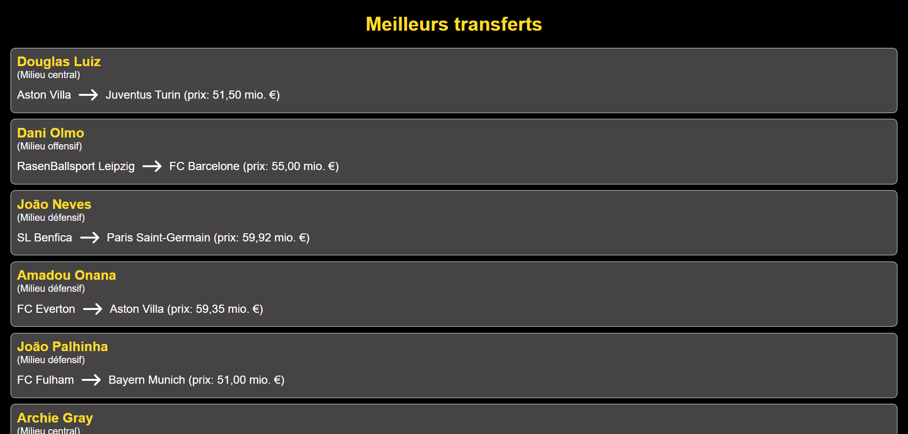

# MEILLEURS TRANSFERTS 2024

### Introduction

Ce projet est une application web développée avec Flask qui utilise Selenium et BeautifulSoup pour extraire des données d'environ 1500 transferts de joueurs de football depuis le site Transfermarkt. Les données récupérées sont affichées sur différentes routes de l'application.



### Prérequis

Assurez-vous d'avoir les éléments suivants installés sur votre machine :

- Python 3.x (version 3.12 recommandée)
- pip (gestionnaire de paquets Python)
- Mozilla Firefox

### Installation

**Clonez le dépôt** :

```bash
git clone https://github.com/sulirb/Meilleurs-transferts-2024-sur-transfermarkt.git
cd Meilleurs transferts 2024 sur transfermarkt
```

### Configuration

**Mettez à jour le chemin vers Firefox** :
Vérifiez que le chemin vers Firefox dans le script correspond à l'emplacement de votre installation de Firefox :

```python
options.binary_location = r'C:\Program Files\Mozilla Firefox\firefox.exe'
```

### Utilisation

1. **Lancez l'application Flask** :

   ```bash
   python api/index.py
   ```

   L'application sera accessible à l'adresse `http://127.0.0.1:5000/`.

2. **Accédez aux différentes routes** :

   - **Page d'accueil** : `http://127.0.0.1:5000/` - Contient des liens vers les différentes catégories de transferts.
   - **Gardiens de but** : `http://127.0.0.1:5000/goalkeepers` - Affiche les transferts des gardiens de but.
   - **Défenseurs** : `http://127.0.0.1:5000/defenders` - Affiche les transferts des défenseurs.
   - **Milieux de terrain** : `http://127.0.0.1:5000/midfielders` - Affiche les transferts des milieux de terrain.
   - **Attaquants** : `http://127.0.0.1:5000/forwards` - Affiche les transferts des attaquants.

   Il y'a également un formulaire disponible, qui vous permettra de rechercher les transferts pour un poste en particulier (ex: milieu central, avant-centre...)

**Attention** :

Le temps de chargement peut être très long (environ 30 secondes), puisque le programme va scanner plusieurs pages de transferts.

### Explication du Code

- **fetch_transfer_data(url)** :
  Cette fonction utilise Selenium pour charger la page web spécifiée par l'URL, extrait les données de transfert des joueurs avec BeautifulSoup, et retourne une liste de transferts formatés en HTML.

- **run_script(base_url, num_pages=6)** :
  Cette fonction génère les URLs des pages à scraper, utilise un ThreadPoolExecutor pour paralléliser les requêtes, et retourne le contenu HTML formaté pour être rendu par Flask.

- **Routes Flask** :
  - `/` : Page d'accueil avec des liens vers les différentes catégories de transferts.
  - `/goalkeepers` : Affiche les transferts des gardiens de but.
  - `/defenders` : Affiche les transferts des défenseurs.
  - `/midfielders` : Affiche les transferts des milieux de terrain.
  - `/forwards` : Affiche les transferts des attaquants.

### Notes

- Assurez-vous que Firefox est correctement installés et configurés sur votre machine.
- Si vous rencontrez des problèmes, vérifiez les chemins d'accès et les permissions des fichiers.

### Contribuer

Les contributions sont les bienvenues ! Veuillez soumettre une pull request ou ouvrir une issue pour discuter des modifications que vous souhaitez apporter.
